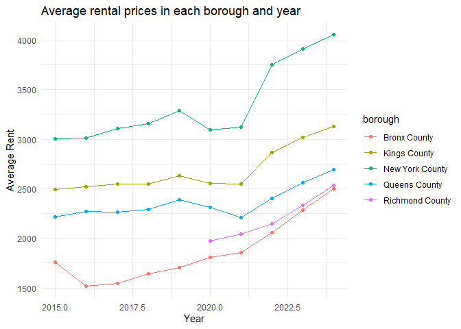
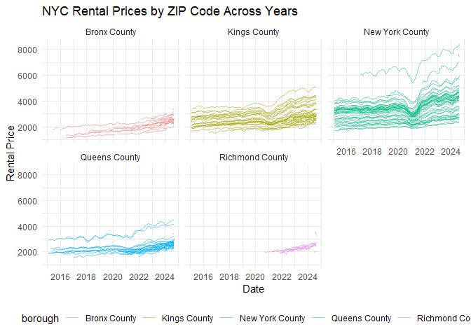
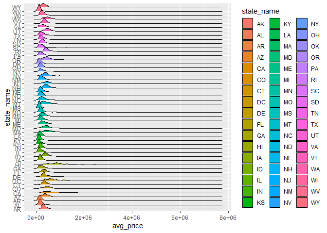
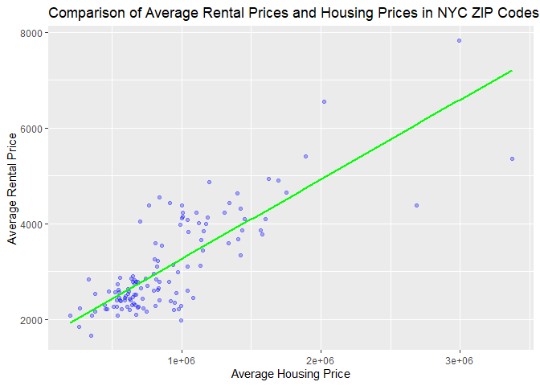

P8105_mtp_zz3309
================
Zebang Zhang
2024-10-23

``` r
library(tidyverse)
```

    ## ── Attaching core tidyverse packages ──────────────────────── tidyverse 2.0.0 ──
    ## ✔ dplyr     1.1.4     ✔ readr     2.1.5
    ## ✔ forcats   1.0.0     ✔ stringr   1.5.1
    ## ✔ ggplot2   3.5.1     ✔ tibble    3.2.1
    ## ✔ lubridate 1.9.3     ✔ tidyr     1.3.1
    ## ✔ purrr     1.0.2     
    ## ── Conflicts ────────────────────────────────────────── tidyverse_conflicts() ──
    ## ✖ dplyr::filter() masks stats::filter()
    ## ✖ dplyr::lag()    masks stats::lag()
    ## ℹ Use the conflicted package (<http://conflicted.r-lib.org/>) to force all conflicts to become errors

``` r
library(rvest)
```

    ## 
    ## Attaching package: 'rvest'
    ## 
    ## The following object is masked from 'package:readr':
    ## 
    ##     guess_encoding

``` r
library(httr)
library(tidyverse)
library(lubridate)
library(ggridges)
```

## Problem1

My goal is to utilize the information in the three datasets and analyze
the rental price and housing price.

I first extract the ZIP code data from the web, I check for columns
names to see what variable it contains.

``` r
url = "https://p8105.com/data/zip_codes.html"
zip_code_data = read_html(url) |> 
  html_table() |> 
  first() |>
  janitor::clean_names() 

names(zip_code_data)
```

    ## [1] "county"       "state_fips"   "county_code"  "county_fips"  "zip_code"    
    ## [6] "file_date"    "neighborhood"

I find county and zip_code are important, so I also investigate their
unique values.

``` r
zip_code_data |> distinct(county)
```

    ## # A tibble: 5 × 1
    ##   county  
    ##   <chr>   
    ## 1 Bronx   
    ## 2 Kings   
    ## 3 New York
    ## 4 Queens  
    ## 5 Richmond

``` r
zip_code_data |> distinct(zip_code)
```

    ## # A tibble: 320 × 1
    ##    zip_code
    ##       <int>
    ##  1    10451
    ##  2    10452
    ##  3    10453
    ##  4    10454
    ##  5    10455
    ##  6    10456
    ##  7    10457
    ##  8    10458
    ##  9    10459
    ## 10    10460
    ## # ℹ 310 more rows

I find there are 320 unique zip codes and 5 unique county names, the
zip_code dataset is of good quality.

``` r
zip_code_data <- zip_code_data %>%
  mutate(borough = case_when(
    county == "Bronx" ~ "Bronx County",
    county == "Kings" ~ "Kings County",
    county == "Richmond" ~ "Richmond County",
    county == "Queens" ~ "Queens County",
    county == "New York" ~ "New York County"
  )) |>
  select(zip_code,borough,neighborhood)

zip_code_data
```

    ## # A tibble: 322 × 3
    ##    zip_code borough      neighborhood              
    ##       <int> <chr>        <chr>                     
    ##  1    10451 Bronx County High Bridge and Morrisania
    ##  2    10452 Bronx County High Bridge and Morrisania
    ##  3    10453 Bronx County Central Bronx             
    ##  4    10454 Bronx County Hunts Point and Mott Haven
    ##  5    10455 Bronx County Hunts Point and Mott Haven
    ##  6    10456 Bronx County High Bridge and Morrisania
    ##  7    10457 Bronx County Central Bronx             
    ##  8    10458 Bronx County Bronx Park and Fordham    
    ##  9    10459 Bronx County Hunts Point and Mott Haven
    ## 10    10460 Bronx County Central Bronx             
    ## # ℹ 312 more rows

A strange thing I discover is that zip code ‘10463’ and ‘11201’ refer to
two different boroughs, but I cannot solve this issue.

``` r
duplicate_zip <- zip_code_data %>%
  group_by(zip_code) %>%
  filter(n() > 1) 

print(duplicate_zip)
```

    ## # A tibble: 4 × 3
    ## # Groups:   zip_code [2]
    ##   zip_code borough         neighborhood             
    ##      <int> <chr>           <chr>                    
    ## 1    10463 Bronx County    Kingsbridge and Riverdale
    ## 2    11201 Kings County    Northwest Brooklyn       
    ## 3    10463 New York County Kingsbridge and Riverdale
    ## 4    11201 New York County Northwest Brooklyn

Then for the NYC Rental data, I find that RegionName actually matches
the zip_code, and City is all ‘New York’, the dataset is proper for
analyzing. But there are some columns not useful for futher analysis,
like ‘SizeRank’.

``` r
rental_data <- read_csv("./data/Zillow/Zip_zori_uc_sfrcondomfr_sm_month_NYC.csv")
```

    ## Rows: 149 Columns: 125
    ## ── Column specification ────────────────────────────────────────────────────────
    ## Delimiter: ","
    ## chr   (6): RegionType, StateName, State, City, Metro, CountyName
    ## dbl (119): RegionID, SizeRank, RegionName, 2015-01-31, 2015-02-28, 2015-03-3...
    ## 
    ## ℹ Use `spec()` to retrieve the full column specification for this data.
    ## ℹ Specify the column types or set `show_col_types = FALSE` to quiet this message.

``` r
rental_data
```

    ## # A tibble: 149 × 125
    ##    RegionID SizeRank RegionName RegionType StateName State City     Metro       
    ##       <dbl>    <dbl>      <dbl> <chr>      <chr>     <chr> <chr>    <chr>       
    ##  1    62080        4      11368 zip        NY        NY    New York New York-Ne…
    ##  2    62093        7      11385 zip        NY        NY    New York New York-Ne…
    ##  3    62019        9      11208 zip        NY        NY    New York New York-Ne…
    ##  4    62046       16      11236 zip        NY        NY    New York New York-Ne…
    ##  5    61807       17      10467 zip        NY        NY    New York New York-Ne…
    ##  6    62085       18      11373 zip        NY        NY    New York New York-Ne…
    ##  7    62037       19      11226 zip        NY        NY    New York New York-Ne…
    ##  8    62018       20      11207 zip        NY        NY    New York New York-Ne…
    ##  9    61639       29      10025 zip        NY        NY    New York New York-Ne…
    ## 10    62025       32      11214 zip        NY        NY    New York New York-Ne…
    ## # ℹ 139 more rows
    ## # ℹ 117 more variables: CountyName <chr>, `2015-01-31` <dbl>,
    ## #   `2015-02-28` <dbl>, `2015-03-31` <dbl>, `2015-04-30` <dbl>,
    ## #   `2015-05-31` <dbl>, `2015-06-30` <dbl>, `2015-07-31` <dbl>,
    ## #   `2015-08-31` <dbl>, `2015-09-30` <dbl>, `2015-10-31` <dbl>,
    ## #   `2015-11-30` <dbl>, `2015-12-31` <dbl>, `2016-01-31` <dbl>,
    ## #   `2016-02-29` <dbl>, `2016-03-31` <dbl>, `2016-04-30` <dbl>, …

``` r
rental_data |> distinct(City)
```

    ## # A tibble: 1 × 1
    ##   City    
    ##   <chr>   
    ## 1 New York

I use pivot_longer() to tidy the columns whose name refer to date and
put them into the variable ‘date’. I restrict the dataset to only
variables necessary.

``` r
date_cols_rental <- colnames(rental_data)[grepl("^\\d{4}-\\d{2}-\\d{2}$",colnames(rental_data))]

rental_data_long <- rental_data %>%
  pivot_longer(cols = all_of(date_cols_rental), 
               names_to = "date", 
               values_to = "rental_price") %>%
  mutate(date = ymd(date)) |>
  janitor::clean_names() |>
  select(region_name, region_type, state_name, city, county_name, date, rental_price )

rental_data_long
```

    ## # A tibble: 17,284 × 7
    ##    region_name region_type state_name city   county_name date       rental_price
    ##          <dbl> <chr>       <chr>      <chr>  <chr>       <date>            <dbl>
    ##  1       11368 zip         NY         New Y… Queens Cou… 2015-01-31           NA
    ##  2       11368 zip         NY         New Y… Queens Cou… 2015-02-28           NA
    ##  3       11368 zip         NY         New Y… Queens Cou… 2015-03-31           NA
    ##  4       11368 zip         NY         New Y… Queens Cou… 2015-04-30           NA
    ##  5       11368 zip         NY         New Y… Queens Cou… 2015-05-31           NA
    ##  6       11368 zip         NY         New Y… Queens Cou… 2015-06-30           NA
    ##  7       11368 zip         NY         New Y… Queens Cou… 2015-07-31           NA
    ##  8       11368 zip         NY         New Y… Queens Cou… 2015-08-31           NA
    ##  9       11368 zip         NY         New Y… Queens Cou… 2015-09-30           NA
    ## 10       11368 zip         NY         New Y… Queens Cou… 2015-10-31           NA
    ## # ℹ 17,274 more rows

Then I merge the two datasets. The issue I mentioned in the zip code
data slightly impact this.

``` r
merged_data <- rental_data_long %>%
  left_join(zip_code_data, by = c("region_name" = "zip_code")) |>
  select(-county_name)
```

    ## Warning in left_join(., zip_code_data, by = c(region_name = "zip_code")): Detected an unexpected many-to-many relationship between `x` and `y`.
    ## ℹ Row 4757 of `x` matches multiple rows in `y`.
    ## ℹ Row 256 of `y` matches multiple rows in `x`.
    ## ℹ If a many-to-many relationship is expected, set `relationship =
    ##   "many-to-many"` to silence this warning.

For the the 2023 US Housing data, the data tidying process is similar.

``` r
housing_2023_data <- read_csv("./data/Zillow/Zip_zhvi_uc_sfrcondo_tier_0.33_0.67_sm_sa_month_2023.csv")
```

    ## Rows: 26338 Columns: 21
    ## ── Column specification ────────────────────────────────────────────────────────
    ## Delimiter: ","
    ## chr  (7): RegionName, RegionType, StateName, State, City, Metro, CountyName
    ## dbl (14): RegionID, SizeRank, 2023-01-31, 2023-02-28, 2023-03-31, 2023-04-30...
    ## 
    ## ℹ Use `spec()` to retrieve the full column specification for this data.
    ## ℹ Specify the column types or set `show_col_types = FALSE` to quiet this message.

``` r
date_cols_housing <- colnames(housing_2023_data)[grepl("^\\d{4}-\\d{2}-\\d{2}$",colnames(housing_2023_data))]
housing_data_long <- housing_2023_data %>%
  pivot_longer(cols = all_of(date_cols_housing), 
               names_to = "date", 
               values_to = "rental_price") %>%
  mutate(date = ymd(date)) |>
  janitor::clean_names() |>
  select(region_name,region_type, state_name, city, county_name, date, rental_price)
```

## Problem2

``` r
na_ratio <- rental_data_long %>%
  summarise(
    total_rows = n(),
    na_count = sum(is.na(rental_price)),
    na_ratio = na_count / total_rows
  )

print(na_ratio)
```

    ## # A tibble: 1 × 3
    ##   total_rows na_count na_ratio
    ##        <int>    <int>    <dbl>
    ## 1      17284     6834    0.395

There are 39.5% NA rental price, many ZIP codes have fewer than 116
observations. Maybe it is because some ZIP code area have no houses to
be rented at the time or people fail to record price.

``` r
unique_count_zip <- zip_code_data %>%
  summarise(unique_zip_count = n_distinct(zip_code))

print(unique_count_zip)
```

    ## # A tibble: 1 × 1
    ##   unique_zip_count
    ##              <int>
    ## 1              320

``` r
unique_count_rental <- rental_data_long %>%
  summarise(unique_rental_count = n_distinct(region_name))

print(unique_count_rental) 
```

    ## # A tibble: 1 × 1
    ##   unique_rental_count
    ##                 <int>
    ## 1                 149

There are 320 unique zip codes in zip code dataset, while there are 149
zip codes in the NYC Rental dataset. The discrepancy may be caused by
the lack of recording or the lack of rental housing in some areas.

``` r
average_rent_by_borough_year <- merged_data %>%
  mutate(year = year(date)) %>% 
  group_by(borough, year) %>%
  summarise(avg_rent = mean(rental_price, na.rm = TRUE))
```

    ## `summarise()` has grouped output by 'borough'. You can override using the
    ## `.groups` argument.

``` r
print(average_rent_by_borough_year)
```

    ## # A tibble: 50 × 3
    ## # Groups:   borough [5]
    ##    borough       year avg_rent
    ##    <chr>        <dbl>    <dbl>
    ##  1 Bronx County  2015    1760.
    ##  2 Bronx County  2016    1520.
    ##  3 Bronx County  2017    1544.
    ##  4 Bronx County  2018    1639.
    ##  5 Bronx County  2019    1706.
    ##  6 Bronx County  2020    1811.
    ##  7 Bronx County  2021    1858.
    ##  8 Bronx County  2022    2054.
    ##  9 Bronx County  2023    2285.
    ## 10 Bronx County  2024    2497.
    ## # ℹ 40 more rows

``` r
#visualize the trend
ggplot(data = average_rent_by_borough_year, aes(x = year, y = avg_rent, color = borough, group = borough)) +
  geom_point() +
  geom_line() +
  labs(title = "Average rental prices in each borough and year",
       x = "Year",
       y = "Average Rent") +
  theme_minimal() + 
  theme(legend.position = "right")
```

    ## Warning: Removed 5 rows containing missing values or values outside the scale range
    ## (`geom_point()`).

    ## Warning: Removed 5 rows containing missing values or values outside the scale range
    ## (`geom_line()`).

<!-- -->

From about 2021, the rental price of every borough is steadily
increasing.

I created a table to compare rental prices in January 2021 to that in
January 2020.

``` r
#first select data in 2020-1-31 and 2021-01-31
january_data <- merged_data %>%
  filter(date %in% as.Date(c("2020-01-31", "2021-01-31")))

compare_zip <- january_data |>
  group_by(region_name) %>%
  pivot_wider(names_from = date, values_from = rental_price) %>%
  mutate(difference=`2021-01-31`-`2020-01-31`) |>
  select(region_name,region_type, `2021-01-31`,`2020-01-31`,difference )
  
compare_zip
```

    ## # A tibble: 151 × 5
    ## # Groups:   region_name [149]
    ##    region_name region_type `2021-01-31` `2020-01-31` difference
    ##          <dbl> <chr>              <dbl>        <dbl>      <dbl>
    ##  1       11368 zip                  NA           NA        NA  
    ##  2       11385 zip                2293.        2510.     -217. 
    ##  3       11208 zip                  NA           NA        NA  
    ##  4       11236 zip                  NA           NA        NA  
    ##  5       10467 zip                1745.        1650.       95.0
    ##  6       11373 zip                  NA           NA        NA  
    ##  7       11226 zip                2181.        2357.     -176. 
    ##  8       11207 zip                2143.        2418.     -275. 
    ##  9       10025 zip                2794.        3286.     -491. 
    ## 10       11214 zip                1798.          NA        NA  
    ## # ℹ 141 more rows

Show for each Borough, the largest drop in price from 2020 to 2021 and
the corresponding neighborhood.

``` r
average_rent_january <- january_data %>%
  group_by(borough, neighborhood, year = year(date)) %>%
  summarise(avg_rent = mean(rental_price, na.rm = TRUE))
```

    ## `summarise()` has grouped output by 'borough', 'neighborhood'. You can override
    ## using the `.groups` argument.

``` r
rent_comparison <- average_rent_january %>%
  pivot_wider(names_from = year, values_from = avg_rent, names_prefix = "year_") %>%
  mutate(drop_in_price = year_2020 - year_2021) 

largest_drop_by_borough <- rent_comparison %>%
  group_by(borough) %>%
  filter(drop_in_price == max(drop_in_price, na.rm = TRUE)) %>%
  select(borough,neighborhood,drop_in_price)
```

    ## Warning: There was 1 warning in `filter()`.
    ## ℹ In argument: `drop_in_price == max(drop_in_price, na.rm = TRUE)`.
    ## ℹ In group 5: `borough = "Richmond County"`.
    ## Caused by warning in `max()`:
    ## ! no non-missing arguments to max; returning -Inf

``` r
print(largest_drop_by_borough)
```

    ## # A tibble: 4 × 3
    ## # Groups:   borough [4]
    ##   borough         neighborhood              drop_in_price
    ##   <chr>           <chr>                             <dbl>
    ## 1 Bronx County    Central Bronx                      1.85
    ## 2 Kings County    Bushwick and Williamsburg        337.  
    ## 3 New York County <NA>                             748.  
    ## 4 Queens County   Northwest Queens                 288.

It can be seen that the largest drop in price in Bronx County is very
small, while that in New York City is the largest, that in Kings County
and Queens County is close.

## Problem 3

Make a plot that show NYC Rental Prices within ZIP codes for all
available years.

``` r
price_across_years=ggplot(data = merged_data, aes(x = date, y = rental_price, color = borough)) +
  geom_line(aes(group = region_name), alpha = 0.5) +  
  facet_wrap(~ borough) +  
  labs(title = "NYC Rental Prices by ZIP Code Across Years",
       x = "Date",
       y = "Rental Price") +
  theme_minimal() +  
  theme(legend.position = "bottom")  

ggsave(filename = "results/price_across_years.png", plot = price_across_years)
```

    ## Saving 7 x 5 in image

    ## Warning: Removed 6804 rows containing missing values or values outside the scale range
    ## (`geom_line()`).

``` r
price_across_years
```

    ## Warning: Removed 6804 rows containing missing values or values outside the scale range
    ## (`geom_line()`).

<!-- -->

At about 2021, in New York County, Kings county and Queens County, there
was an obvious decrease in many zip-code regions.

I create a table to compute the average house price within each ZIP code
over each month in 2023.

``` r
average_price_by_zip_month <- housing_data_long %>%
  mutate(month = floor_date(date, "month")) %>%  
  group_by(region_name, month) %>%
  summarise(avg_price = mean(rental_price, na.rm = TRUE)) %>%
  mutate(month = format(month, "%Y-%m"))
```

    ## `summarise()` has grouped output by 'region_name'. You can override using the
    ## `.groups` argument.

``` r
print(average_price_by_zip_month)
```

    ## # A tibble: 316,056 × 3
    ## # Groups:   region_name [26,338]
    ##    region_name month   avg_price
    ##    <chr>       <chr>       <dbl>
    ##  1 01001       2023-01   295063.
    ##  2 01001       2023-02   295956.
    ##  3 01001       2023-03   297317.
    ##  4 01001       2023-04   299400.
    ##  5 01001       2023-05   301701.
    ##  6 01001       2023-06   303843.
    ##  7 01001       2023-07   306040.
    ##  8 01001       2023-08   308505.
    ##  9 01001       2023-09   311004.
    ## 10 01001       2023-10   312748.
    ## # ℹ 316,046 more rows

Make a reader-friendly plot to show the distribution of ZIP-code-level
house prices across states.

``` r
zip_level_price <- housing_data_long %>%
  group_by(state_name, region_name) %>%  
  summarise(avg_price = mean(rental_price, na.rm = TRUE))  
```

    ## `summarise()` has grouped output by 'state_name'. You can override using the
    ## `.groups` argument.

``` r
zip_level_price
```

    ## # A tibble: 26,338 × 3
    ## # Groups:   state_name [51]
    ##    state_name region_name avg_price
    ##    <chr>      <chr>           <dbl>
    ##  1 AK         99501         303040.
    ##  2 AK         99502         387141.
    ##  3 AK         99503         297116.
    ##  4 AK         99504         323947.
    ##  5 AK         99507         369313.
    ##  6 AK         99508         304896.
    ##  7 AK         99515         419554.
    ##  8 AK         99516         578255.
    ##  9 AK         99517         357188.
    ## 10 AK         99518         293098.
    ## # ℹ 26,328 more rows

``` r
ggplot(zip_level_price, aes(x = avg_price, y = state_name, fill = state_name)) + 
  geom_density_ridges()
```

    ## Picking joint bandwidth of 36400

    ## Warning: Removed 116 rows containing non-finite outside the scale range
    ## (`stat_density_ridges()`).

<!-- -->

In every state, the ZIP-code-level house price distribution is a
Normal-like distribution, with high density in the center and low
density on both sides.

``` r
ny_2023_rental <- merged_data %>%
  filter(state_name == "NY", city == "New York", year(date) == 2023) %>%
  group_by(region_name) %>%
  summarise(avg_rental_price = mean(rental_price, na.rm = TRUE))

ny_2023_housing <- housing_data_long %>%
  filter(state_name == "NY", city == "New York") %>%
  group_by(region_name) %>%
  summarise(avg_housing_price = mean(rental_price, na.rm = TRUE))

ny_2023_rental <- ny_2023_rental %>%
  mutate(region_name = as.character(region_name))

ny_2023_housing <- ny_2023_housing %>%
  mutate(region_name = as.character(region_name))

ny_rent_vs_housing <- ny_2023_rental %>%
  inner_join(ny_2023_housing, by = "region_name")

ny_rent_vs_housing
```

    ## # A tibble: 145 × 3
    ##    region_name avg_rental_price avg_housing_price
    ##    <chr>                  <dbl>             <dbl>
    ##  1 10001                  4910.          1692425.
    ##  2 10002                  4238.          1009289.
    ##  3 10003                  4317.          1422138.
    ##  4 10004                  3846.          1156242.
    ##  5 10005                  4005.          1120276.
    ##  6 10006                  4388.          1003514.
    ##  7 10007                  7821.          2994558.
    ##  8 10009                  4108.          1001662.
    ##  9 10010                  4433.          1338932.
    ## 10 10011                  4930.          1623876.
    ## # ℹ 135 more rows

``` r
ggplot(ny_rent_vs_housing, aes(x = avg_housing_price, y = avg_rental_price)) +
  geom_point(alpha = 0.3,color='blue') +  
  labs(title = "Comparison of Average Rental Prices and Housing Prices in NYC ZIP Codes (2023)",
       x = "Average Housing Price",
       y = "Average Rental Price") +
   geom_smooth(method = "lm", color = "green", se = FALSE)
```

    ## `geom_smooth()` using formula = 'y ~ x'

    ## Warning: Removed 22 rows containing non-finite outside the scale range
    ## (`stat_smooth()`).

    ## Warning: Removed 22 rows containing missing values or values outside the scale range
    ## (`geom_point()`).

<!-- -->

Seems like housing price and rental price are positively and linearly
correlated, the trend is that one will increase if the other increases.

The limitations are that there are still NA values in rental price and
there is an issue about zip code dataset that I previously mentioned.
